**Portfolio website**: https://tjde.github.io

**Github repo**: https://github.com/tjde/tjde.github.io

## Website Description ##

**i. Purpose**

To create a portfolio website that showcases my technical skills to interested parties via the projects presented and how the webpage was designed. This will also serve to establish my personal brand, provide details about myself and various ways to contact me.

**ii. Functionality**

The portfolio has a top navigation bar with various clickable menu headings on the left of the screen. Hovering over each heading will highlight it in green and when clicked, will take the user directly to the different areas of the website. The navigation bar is responsive ie, it will disappear when a user is scrolling down the page and will reappear when scrolling up.

Areas of the website include:

*A. Home* - Brings user to the landing page.

*B. Projects* - A demonstration of past and current projects with descriptions and links. 

*C. About Me* - Details current and previous occupations, history and interests.

*D. Contact* - Contains the email, github and linkedin icons that when clicked will open a new window with direct links to my email and social media pages.

**iii. Sitemap**

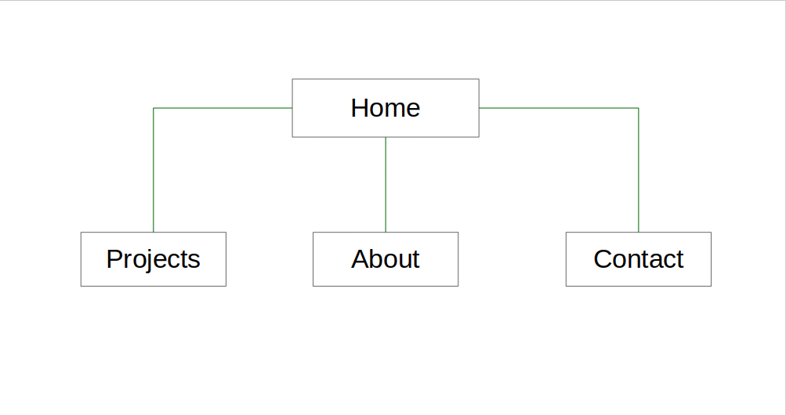

**iv. Screenshots**

Desktop

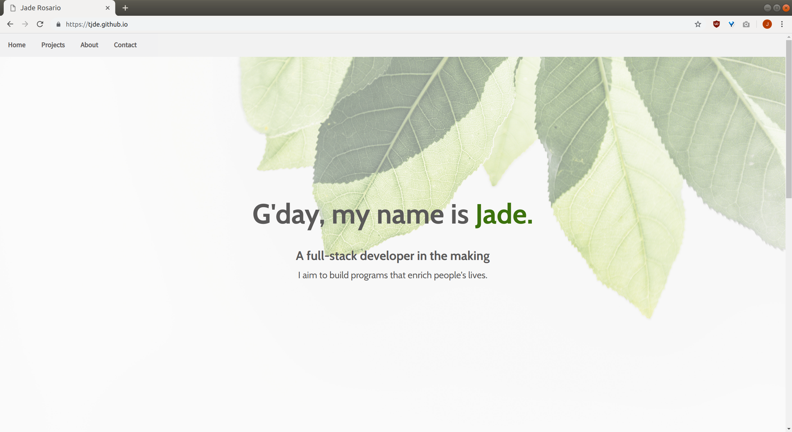
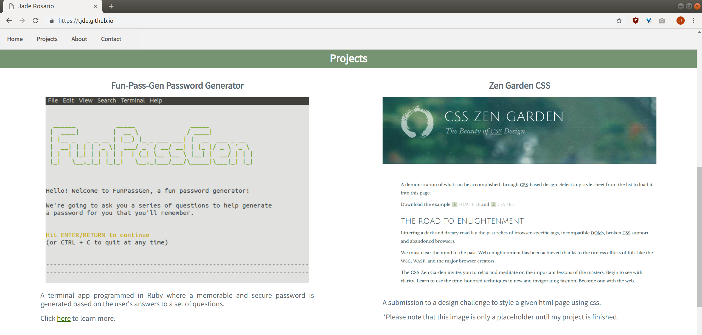
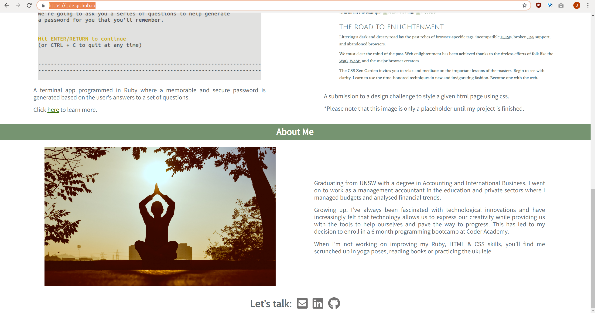

Mobile

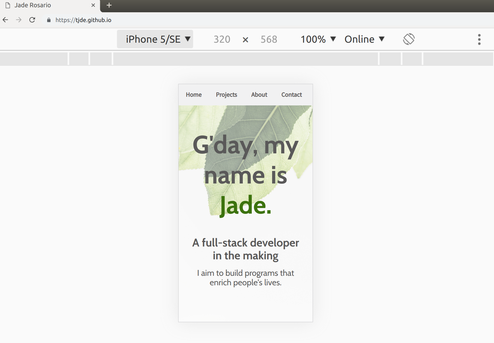
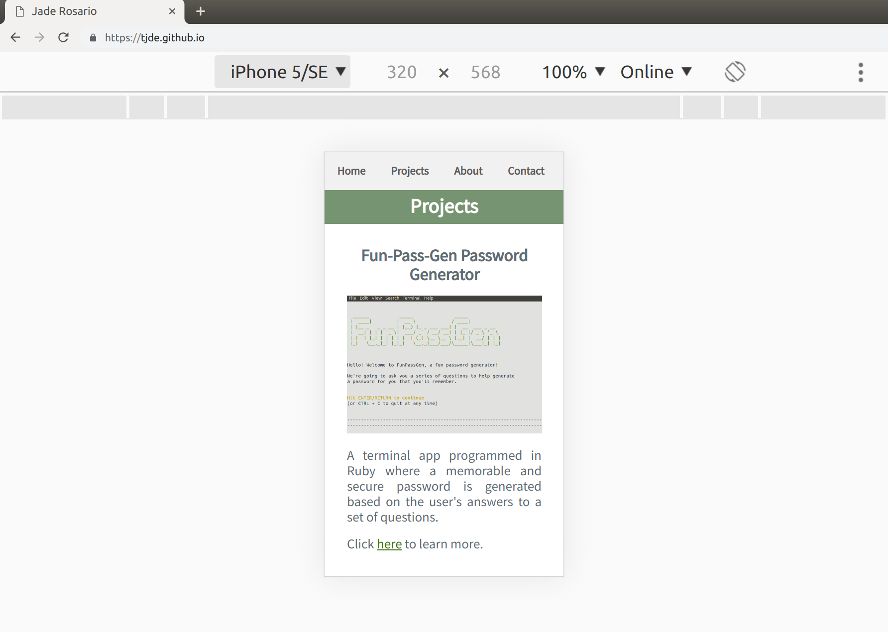
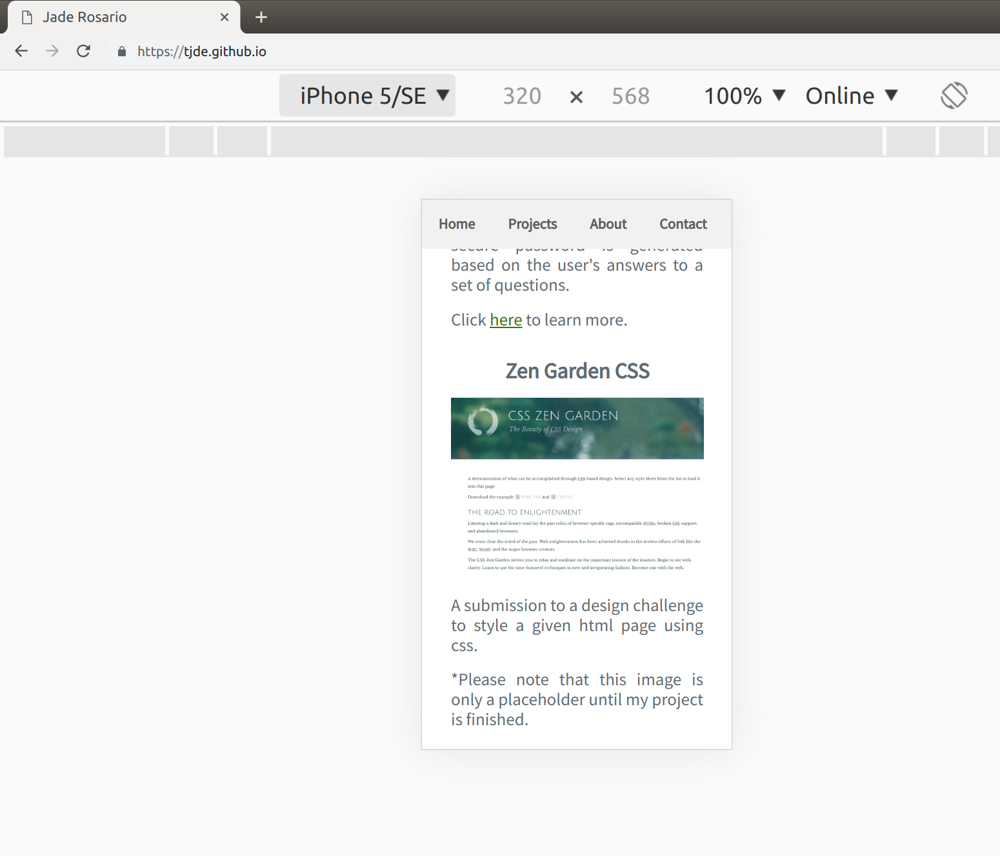
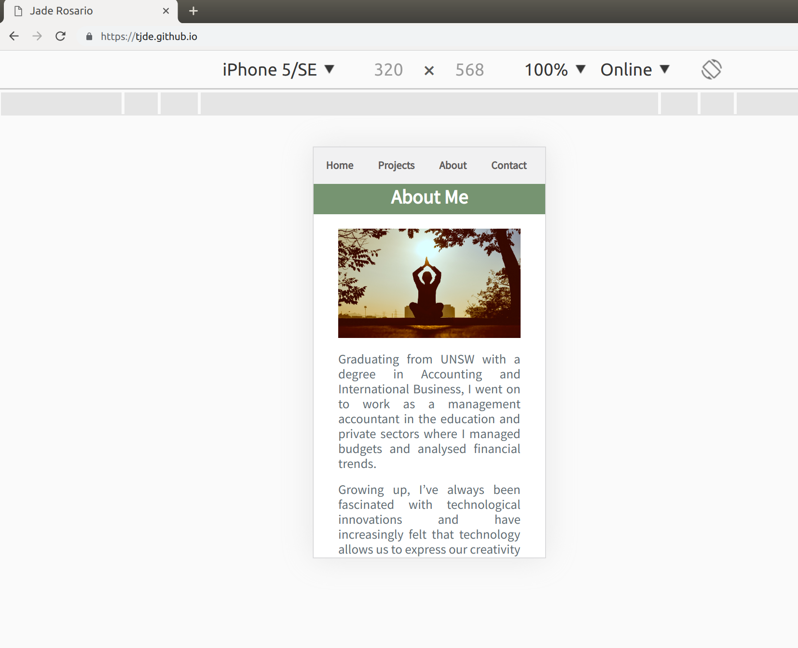
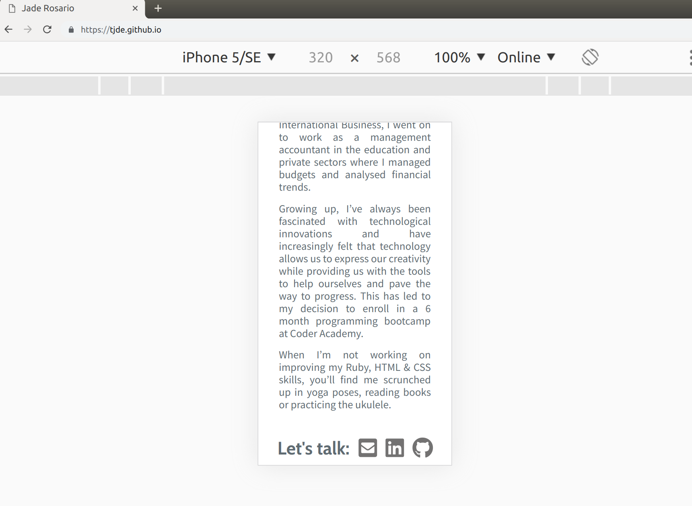

**v. Target Audience**

The target audience includes educators, potential employers, recruiters, other programmers and anybody who may be interested in tech or learning to program.

**vi. Tech Stack**

The tech stack utilised in this project includes: Trello, Balsamiq, Github, Github Pages,HTML and CSS

## Design Documentation: ##

**i. Design Process**

My design process started with moodboarding at Trello. I wanted to have a consistent color scheme that evoked a feeling of calm and serenity, which has led to my decision to pick the colors green, white and gray for my website.

I also searched for other portfolios and took note of the designs I liked. I found that I preferred a more typography-centered minimalist design with lots of whitespace over flashy animations which I tried to emulate in my pages. 

**ii. Wireframes**

Balsamiq was used to create the desktop and mobile wireframes below.

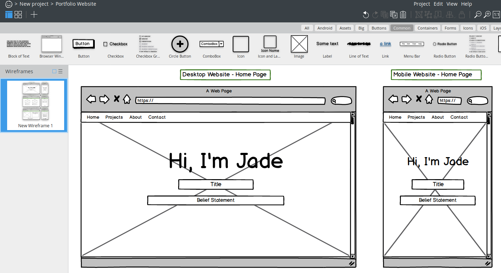
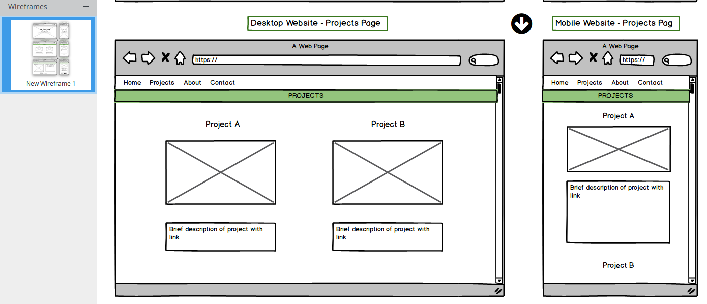
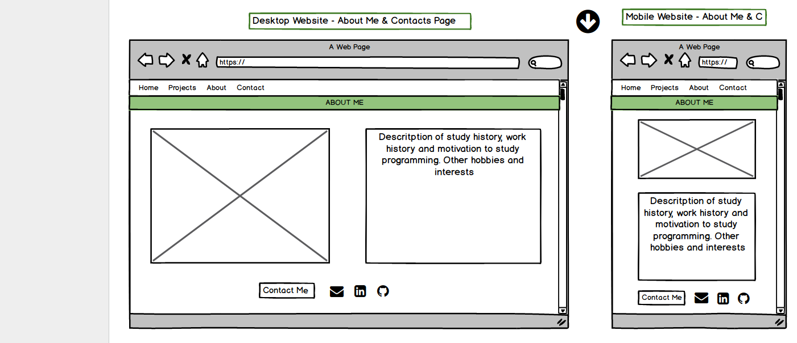

**iii. Usability Considerations**

The website has a very consistent layout in terms of aesthetics and navigation and is designed to be responsive to mobile devices. The content is neatly laid out in a logical fashion with a menu heading that appears only when needed. All links are functioning and connect straight to my other social media profiles. Accessibility considerations include a consistent color scheme that has a good contrast ratio as well as the incorporation of revelevant "alt" tags to pictures.

## III. Planning Process: ##

The website and its documentation were to be finished in 6 days. 

I spent the first day looking at other portfolios, taking note of the layouts and aesthetics that I liked. Then I started a new Trello Board to brainstorm ideas and lay out all the tasks that needed to be done initially and ones for further down the line.

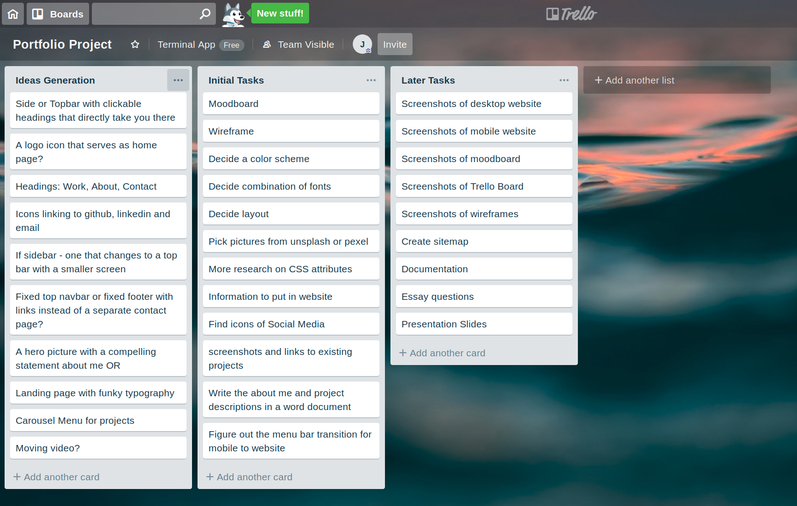

My planning process can be summed up as follows:

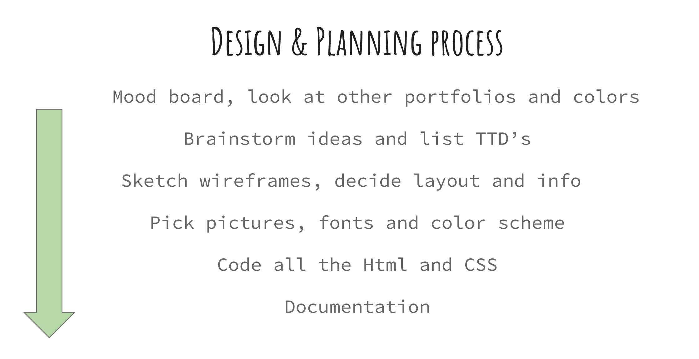

## IV. Development of the internet ##

**Key events in the development of the internet from the 1980s to today**

In 1981, the NSF provided a grant to provide networking services to university computer scientists. TCP and IP were codified as the protocol suite in 1982. The domain naming system was established in 1983, In 1990, Tim Berners-Lee develops HTML and in 1991, CERN introduces the web to the public. In 1992, the first audio and video were distributed over the internet. In 1994, Microsoft created the browser for Windows 95 and Yahoo appeared. In 1995, CompuServe, America Online, and Prodigy start providing dial-up Internet access and Amazon, Craigslist and Ebay emerged. In 1998, Google search appeared and the Internet Protocal v6 was introduced.  In 1999, peer to peer sharing via Napster was invented. In 2000, the proliferation of viruses occurred and the internet bubble burst. In 2003, Skype and Wordpress debut. In 2004, Facebook goes online. Youtube and Reddit launches in 2005. In 2006, Twitter launches and in 2016, Google launches Google assistant.

**Define and describes the relationship between fundamental aspects of the internet such as: domains, web servers, DNS, and web browsers**

Computers in the web are either either clients, which are the devices we use to connect to the internet (phone with 4g, laptop with wifi) or servers which are computers that act as storage for webpages, sites and apps. When we open a web browser, which is an application that allows us to access information on the web, and type in an web address (the domain) we would like to go to, the browser converts the domain name typed to the real web address of the page, a string of numbers called the IP address via the Domain Name Server.  The browser will then send a HTTP request message to the server to obtain a copy of the website which it will then display to the user’s window.

**Reflect on one aspect of the development of internet technologies and how it has contributed to the world today**

The widespread development and access to high speed wireless internet all around the world has revolutionised the speed of information distribution and has made it so that anyone who has a working internet connection gains access to the world’s collective knowledge, including those from the poorest countries. This is unprecedented as traditionally there have been gatekeepers and middlemen who stood in the way. Now we have encyclopedias that anyone can contribute to, online learning platforms with material from top universities, forums in every kind of subject all over the place that allows for mass participation, video tutorials and music of every kind that one can find at the tip of the fingertips. We can know cheaply and instantaneously communicate with one other over long distances and connect directly to our political leaders and greatest thinkers of our time.