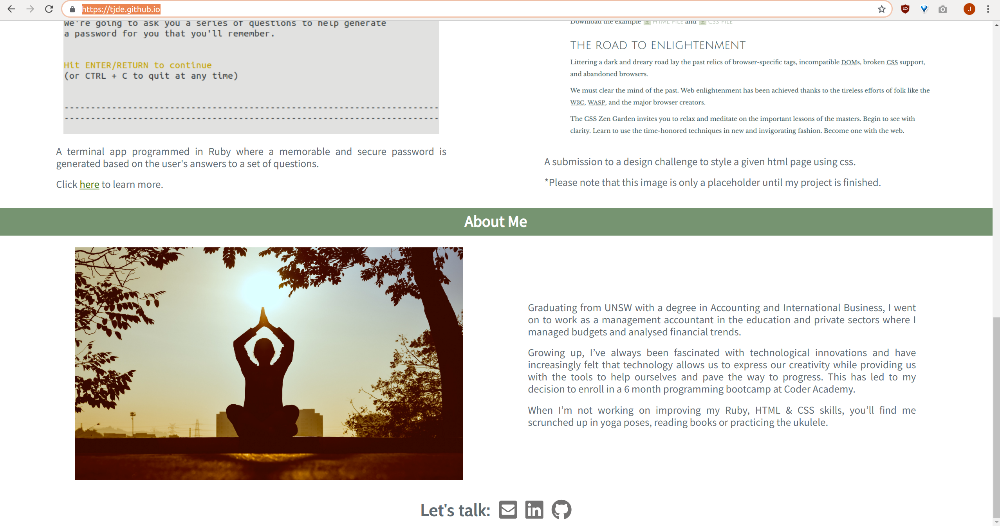
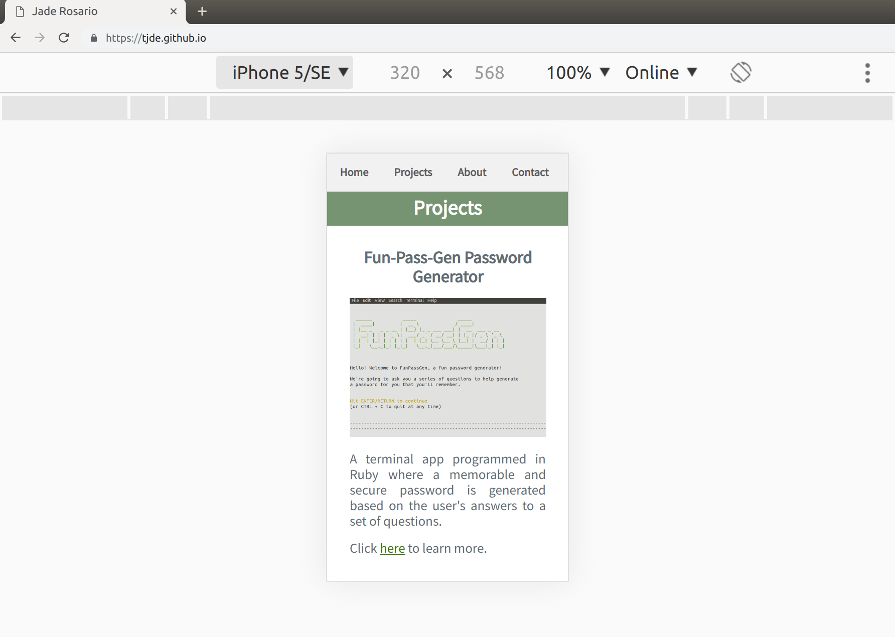
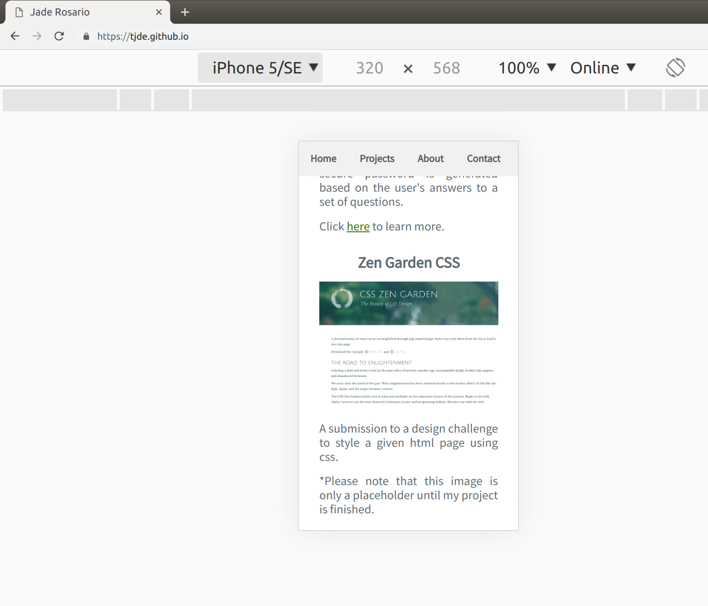
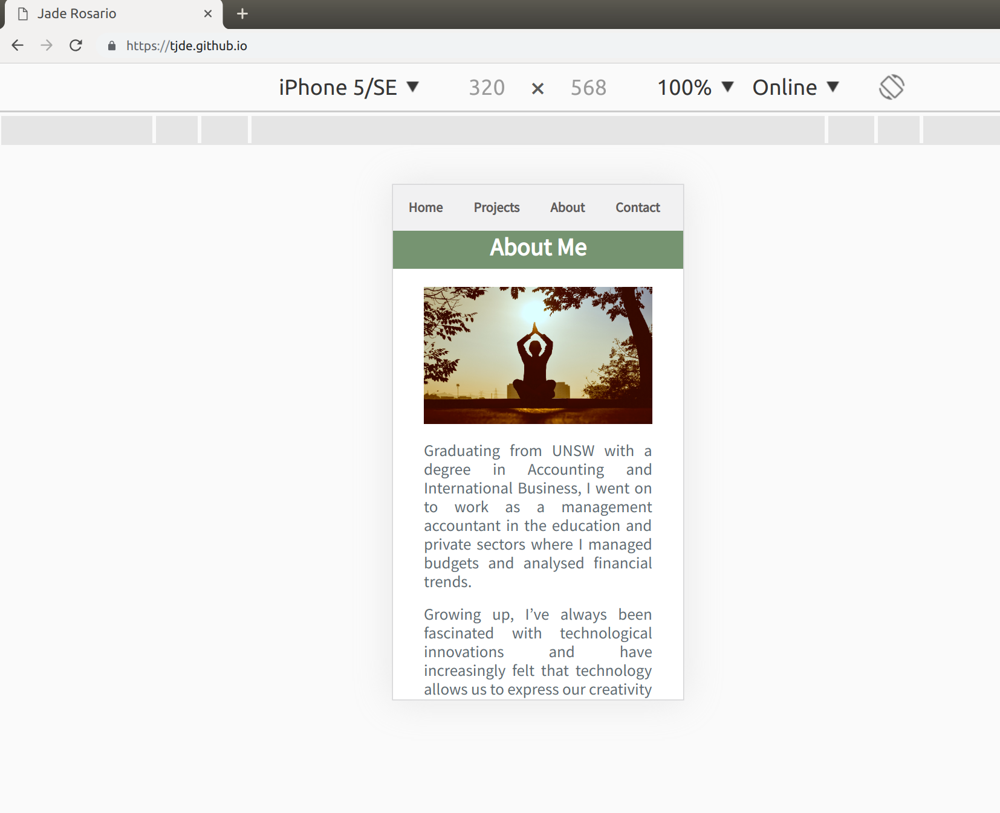
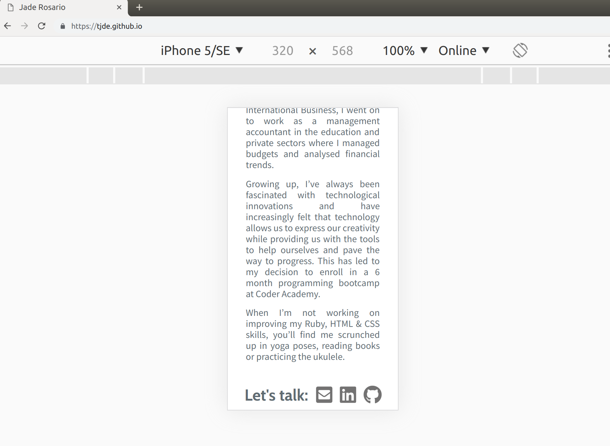

**Portfolio website**: https://tjde.github.io
**Github repo**: https://github.com/tjde/tjde.github.io

##Website Description:##

**i. Purpose**

To create a portfolio that demonstrates my knowledge and application of html and css, showcases my skills and the tech stack I'm familiar with, contains links to my contact details and social media profiles and a brief information about myself.

**ii. Functionality**

The portfolio has a top navigation bar with various clickable menu headings on the left of the screen. Hovering over each heading will highlight it in green and when clicked, will take the user directly to the different areas of the website. The navigation bar is responsive ie, it will disappear when a user is scrolling down the page and will reappear when scrolling up.

Areas of the website include:

*A. Home* - Brings user to the landing page.
*B. Projects* - A demonstration of past and current projects. 
*C. About Me* - Details current and previous occupations, history and interests.
*D. Contact* - Contains the email, github and linkedin icons that when clicked will open a new window with                 direct links to my email and social media pages.

**iii. Sitemap**

**iv. Screenshots**

Desktop

Mobile

**v. Target Audience**

The target audience includes educators, potential employers, recruiters, other programmers and anybody who may be interested in tech or learning to program.

**vi. Tech Stack**

The tech stack utilised in this project includes: Trello, Balsamiq, Github, HTML and CSS

##Design Documentation:##

**i. Design Process**

**ii. Wireframes**

**iii. Usability Considerations**

##III. Planning Process:##

##IV. Development of the internet##

 Describe key events in the development of the internet from the 1980s to today (max. 150 words)

    Define and describes the relationship between fundamental aspects of the internet such as: domains, web servers, DNS, and web browsers (max. 150 words)
    Reflect on one aspect of the development of internet technologies and how it has contributed to the world today (max. 150 words)

<!-- Description

This project is to be completed individually.

You are to design, build, deploy and present a portfolio website.

At a minimum, your website must include the following information,

    Your name and contact details.
    Links to your Github and LinkedIn accounts.
    Information about you to demonstrate your personality.
    Your study and work history.

Your portfolio website forms part of the greater internet. A fullstack developer must have an appreciation & understanding of the historical and technical aspects of the web. To satisfy diploma requirements, include short answers to the following questions in your documentation,

    Describe key events in the development of the internet from the 1980s to today (max. 150 words)
    Define and describes the relationship between fundamental aspects of the internet such as: domains, web servers, DNS, and web browsers (max. 150 words)
    Reflect on one aspect of the development of internet technologies and how it has contributed to the world today (max. 150 words)

Deliverable
	

Description
	

Location
(in Zip file)

README.md
	

Project documentation is to be compiled as a single markdown file named README.md

This file should contain,

    A link (URL) to your published portfolio website
    A link to your GitHub repository
        Ensure the repository (repo) is accessible by your Educators
    Description of your portfolio website, including,
        Purpose
        Functionality / features
        Sitemap
        Screenshots
        Target audience
        Tech stack (e.g. html, css, deployment platform, etc)
    Design documentation including,
        Design process
        Wireframes
        Personal logo (optional)
        Usability considerations
    Details of planning process including,
        Project plan & timeline
        Screenshots of Trello board(s)

    Short Answer Q&A - Include short answers to the following questions,
        Describe key events in the development of the internet from the 1980s to today (max. 150 words)
        Define and describes the relationship between fundamental aspects of the internet such as: domains, web servers, DNS, and web browsers (max. 150 words)
        Reflect on one aspect of the development of internet technologies and how it has contributed to the world today (max. 150 words)

	

/
(Root folder of your zip file)

Resources
	

All files linked by the README.md file must be included in a folder named docs

All resources included in this folder must be in either png, jpeg, pdf, or markdown format
	

docs/

Source Code
	

Source code for your entire website
	
https://coderacademy.instructure.com/courses/162/assignments/732
src/ -->

