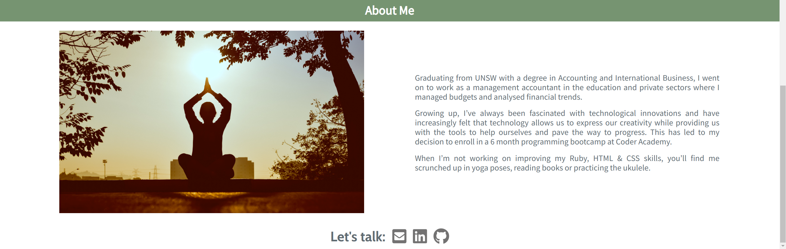

**Portfolio website**: https://tjde.github.io

**Github repo**: https://github.com/tjde/tjde.github.io

## Website Description ##

**i. Purpose**

To create a portfolio website that showcases my technical skills to interested parties via the projects presented and how the webpage was designed. This will also serve to establish my personal brand, provide details about myself and various ways to contact me.

**ii. Functionality**

The portfolio has a top navigation bar with various clickable menu headings on the left of the screen. Hovering over each heading will highlight it in green and when clicked, will take the user directly to the different areas of the website. The navigation bar is responsive ie, it will disappear when a user is scrolling down the page and will reappear when scrolling up.

Areas of the website include:

*A. Home* - Brings user to the landing page.

*B. Projects* - A demonstration of past and current projects. 

*C. About Me* - Details current and previous occupations, history and interests.

*D. Contact* - Contains the email, github and linkedin icons that when clicked will open a new window with                 direct links to my email and social media pages.

**iii. Sitemap**

**iv. Screenshots**

Desktop

Mobile

**v. Target Audience**

The target audience includes educators, potential employers, recruiters, other programmers and anybody who may be interested in tech or learning to program.

**vi. Tech Stack**

The tech stack utilised in this project includes: Trello, Balsamiq, Github, HTML and CSS

## Design Documentation: ##

**i. Design Process**

**ii. Wireframes**

**iii. Usability Considerations**

## III. Planning Process: ##

## IV. Development of the internet ##

 Describe key events in the development of the internet from the 1980s to today (max. 150 words)

    Define and describes the relationship between fundamental aspects of the internet such as: domains, web servers, DNS, and web browsers (max. 150 words)
    Reflect on one aspect of the development of internet technologies and how it has contributed to the world today (max. 150 words)

