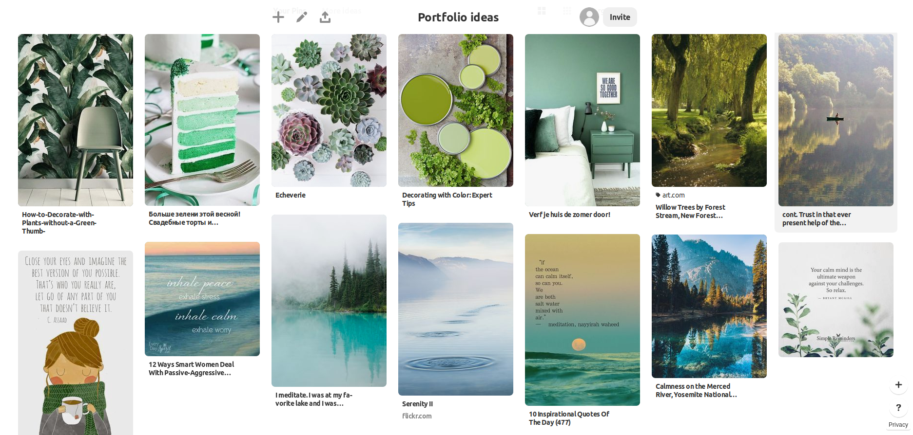

**Portfolio website**: https://tjde.github.io

**Github repo**: https://github.com/tjde/tjde.github.io

## Website Description ##

**i. Purpose**

To create a portfolio website that showcases my technical skills to interested parties via the projects presented and how the webpage was designed. This will also serve to establish my personal brand, provide details about myself and various ways to contact me.

**ii. Functionality**

The portfolio has a top navigation bar with various clickable menu headings on the left of the screen. Hovering over each heading will highlight it in green and when clicked, will take the user directly to the different areas of the website. The navigation bar is responsive ie, it will disappear when a user is scrolling down the page and will reappear when scrolling up.

Areas of the website include:

*A. Home* - Brings user to the landing page.

*B. Projects* - A demonstration of past and current projects. 

*C. About Me* - Details current and previous occupations, history and interests.

*D. Contact* - Contains the email, github and linkedin icons that when clicked will open a new window with                 direct links to my email and social media pages.

**iii. Sitemap**

**iv. Screenshots**

Desktop

Mobile

**v. Target Audience**

The target audience includes educators, potential employers, recruiters, other programmers and anybody who may be interested in tech or learning to program.

**vi. Tech Stack**

The tech stack utilised in this project includes: Trello, Balsamiq, Github, HTML and CSS

## Design Documentation: ##

**i. Design Process**

My design process started with moodboarding at Trello. I wanted to have a consistent color scheme that evoked a feeling of calm and serenity, which has led to my decision to pick the colors green, white and gray for my website.

I also searched for other portfolios and took note of the designs I liked. I found that I preferred a more typography-centered minimalist design with lots of whitespace over flashy animations which I tried to emulate in my pages. 

**ii. Wireframes**

Balsamiq was used to create the desktop and mobile wireframes below.

**iii. Usability Considerations**

The website has a very consistent layout in terms of aesthetics and navigation and is designed to be responsive to mobile devices. The content is neatly laid out in a logical fashion with a menu heading that appears only when needed. All links are functioning and connect straight to my other social media profiles. Accessibility considerations include a consistent color scheme that has a good contrast ratio as well as the incorporation of revelevant "alt" tags to pictures.

## III. Planning Process: ##

The website and its documentation were to be finished in 6 days. 

I spent the first day looking at other portfolios, taking note of the layouts and aesthetics that I liked. Then I started a new Trello Board to brainstorm ideas and lay out all the tasks that needed to be done initially and ones for further down the line.

My planning process can be summed up as follows:

## IV. Development of the internet ##

**Key events in the development of the internet from the 1980s to today**

**Define and describes the relationship between fundamental aspects of the internet such as: domains, web servers, DNS, and web browsers**

**Reflect on one aspect of the development of internet technologies and how it has contributed to the world today**

